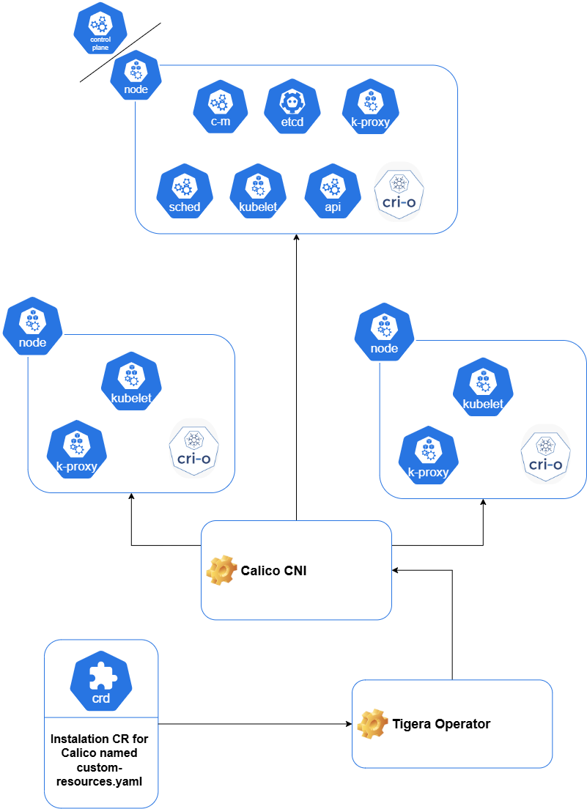
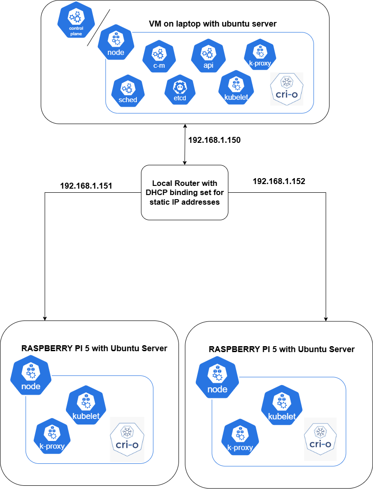

# Kubernetes
That repository contains the necessary instructions to set up kubernetes cluster inside an on-premise cluster of nodes connected through a router with static IPs 192.168.1.150, 192.168.1.151, and 192.168.1.152.  
So far, I've been able to successfully deploy Spark on Kubernetes, Kafka, Minio, Prometheus, Grafana, Project Nessie (versioned Hive Metastore) that stores Iceberg tables on S3 through Spark. 

Now I'll start experimenting with ElasticSearch, AirFlow, Neo4j, MongoDB, Flink, Cassandra, Milvus and Kubeflow and other Big Data software to replicate production-like environments and conditions, including things like high availability, fault tolerance, etc... 

Each new deployed technology have it's own folder with text, markdown or yaml files that explain how to set it up inside the cluster and how to integrate it with the other technologies when necessary.

Here are two diagrams,  the first one ilustrates how the Kubernetes cluster is set up using Calico as the container network interface (CNI).

And the base network and conections upon which the kubernetes cluster is set up.

